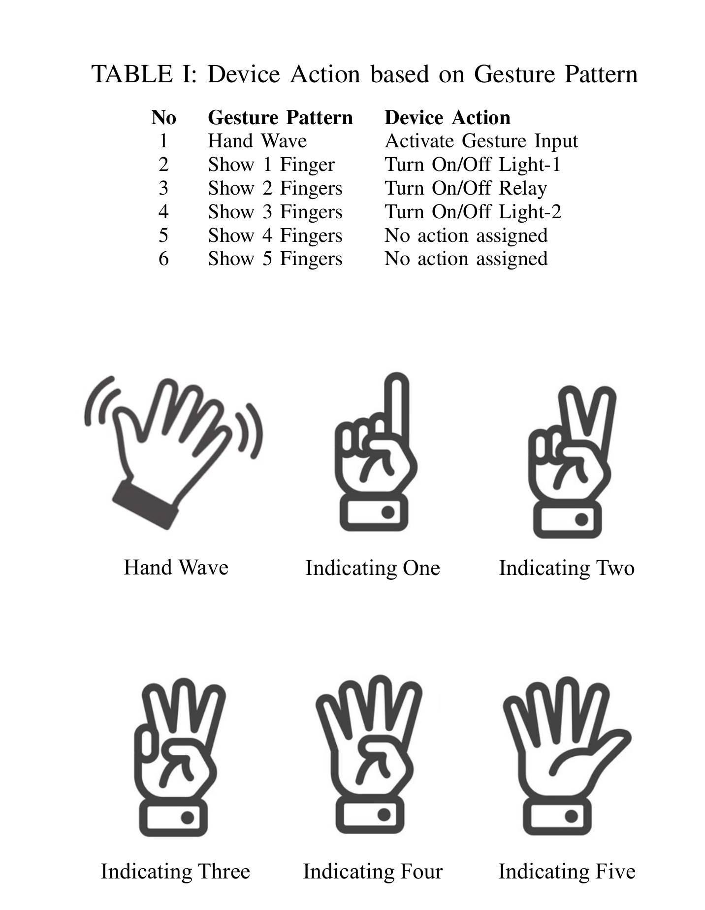

**Abstract:** With the advancement of IoT devices and technology, smart devices can communicate with each other which makes home automation systems more engaging. App-based and voice-based home automation is quite common these days, though they have their own limitation (i.e., not all smart devices are compatible with one app, command interpretation problems because of the accent). Acknowledging this problem, we have proposed a computer vision-based home automation system using Raspberry pi 4 and a camera module. In our home automation system, we demonstrated that gesture recognition can be a viable way to control the devices to avoid the wrong interpretation of commands. For a better understanding of the feasibility and efficiency of our system, we used three devices with multiple functionalities. Our evaluation shows that the gesture recognition is 90 percent which ensures the accuracy of command interpretation. 

